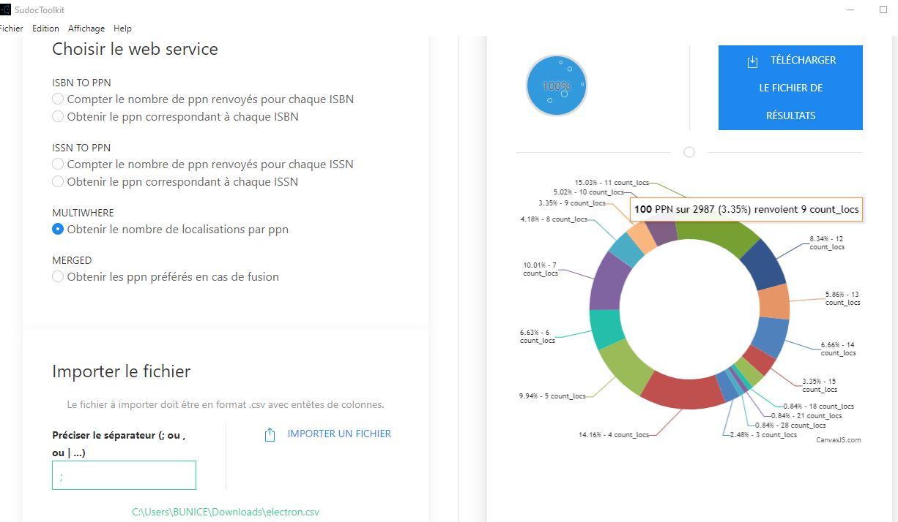

# SudocToolkit

Une Interface utilisateur pour faire tourner les web services de l'Abes sans être développeur.

Les web services utilisés : 

1. [isbn2ppn](http://documentation.abes.fr/sudoc/manuels/administration/aidewebservices/index.html#isbn2ppn) : renvoie le (ou les) ppn à partir d'un ISBN

2. [issn2ppn](http://documentation.abes.fr/sudoc/manuels/administration/aidewebservices/index.html#issn2ppn) : renvoie le (ou les) ppn à partir d'un ISSN

3. [merged](http://documentation.abes.fr/sudoc/manuels/administration/aidewebservices/index.html#merged) : renvoie le ppn actif (en cas de fusion de notices) à partir d'un ppn

4. [multiwhere](http://documentation.abes.fr/sudoc/manuels/administration/aidewebservices/index.html#multiwhere) : renvoie les RCR localisés à partir d'un ppn

## Installation

### En mode développement dans l'environnement Node.js

* Cloner le dépôt : git clone https://github.com/gegedenice/SudocToolkit.git
* Installer les dépendances : npm install
* Lancer : npm run start
* Automatiser les mises à jour dans l'interface en cas de modification du code source : décommenter la 1ère ligne require('electron-reload')(__dirname) dans main.js

### Télécharger l'exécutable Windows

* Télécharger la dernière release https://github.com/gegedenice/SudocToolkit/releases
* Dézipper où vous voulez sur votre PC
* Double-cliquer sur SudocToolkit.exe